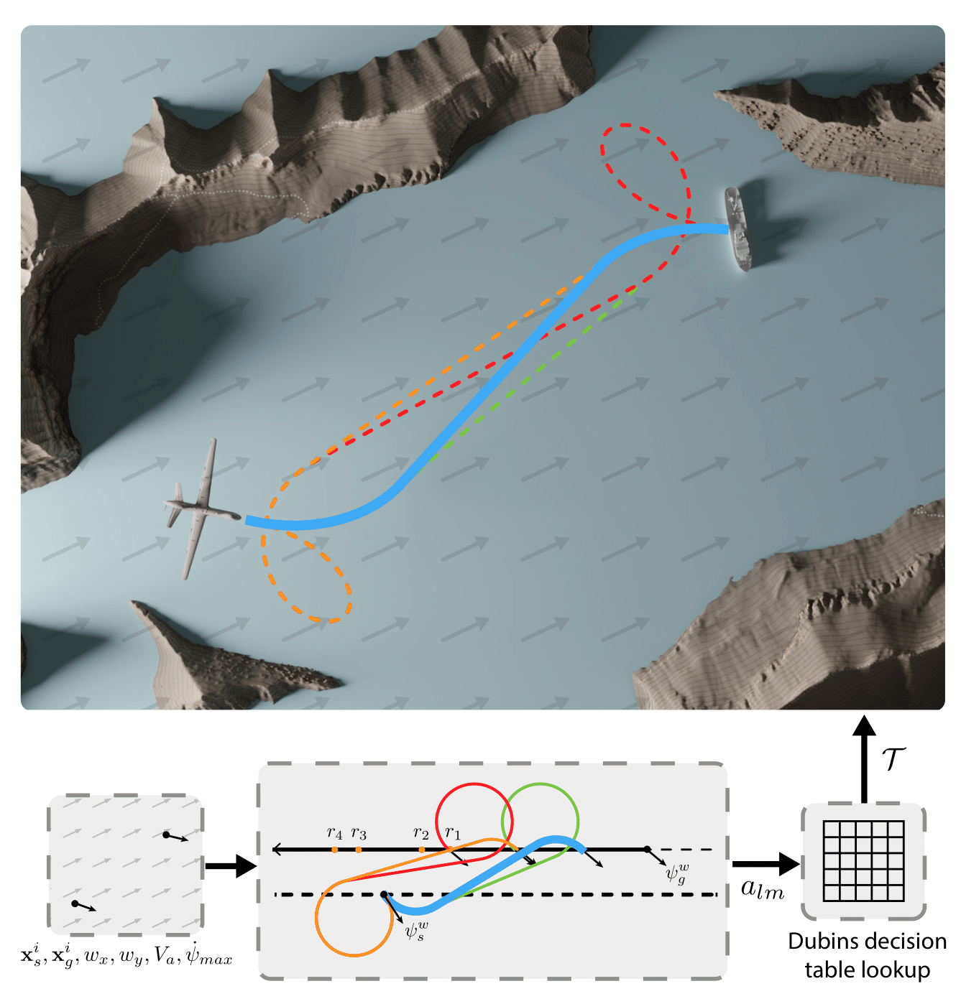

# Time-Optimal Path Planning in a Constant Wind for Uncrewed Aerial Vehicles using Dubins Set Classification 

This repository contains code for the paper
**<a href="https://arxiv.org/abs/2306.11845">"Time-Optimal Path Planning in a Constant Wind for Uncrewed Aerial Vehicles using Dubins Set Classification"</a>**  by *<a href="https://bradymoon.com">Brady Moon\*</a>, <a href="https://sagars2.com">Sagar Sachdev\*</a>, <a href="https://theairlab.org/team/junbiny/">Junbin Yuan</a>, and <a href="https://www.ri.cmu.edu/ri-faculty/sebastian-scherer/">Sebastian Scherer</a> (\* equal contribution)*.

This codebase includes both a solver for trochoidal paths when there is wind as well as also solving Dubins paths when there is no wind. The Dubins path solutions use the work <a href="http://dx.doi.org/10.1016/S0921-8890(00)00127-5">"Classification of the Dubins set"</a> as well as the correction proposed in the work  <a href="https://www.research-collection.ethz.ch/handle/20.500.11850/615185">"Circling Back: Dubins set Classification Revisited."</a>

<p align="center">   
    
</p>

## Brief Overview
Time-optimal path planning in high winds for a turning-rate constrained UAV is a challenging problem to solve and is important for deployment and field operations. Previous works have used trochoidal path segments comprising straight and maximum-rate turn segments, as optimal extremal paths in uniform wind conditions. Current methods iterate over all candidate trochoidal trajectory types and select the one that is time-optimal; however, this exhaustive search can be computationally slow. In this paper, we introduce a method to decrease the computation time. This is achieved by reducing the number of candidate trochoidal trajectory types by framing the problem in the air-relative frame and bounding the solution within a subset of candidate trajectories. Our method reduces overall computation by 37.4% compared to pre-existing methods in Bang-Straight-Bang trajectories, freeing up computation for other onboard processes and can lead to significant total computational reductions when solving many trochoidal paths. When used within the framework of a global path planner, faster state expansions help find solutions faster or compute higher-quality paths. We also release our open-source codebase as a C++ package.


## Prerequisites
* Ubuntu 18.04 or 20.04
* ROS Melodic or Noetic 
* Python 3.6+ (For visualizations)
* Google Benchmark (For benchmarks)
    * `sudo apt-get install libbenchmark-dev`

### Building and Installation

Clone this repo in your catkin workspace or create a new workspace like in the following:

```bash
mkdir -p ~/trochoids_ws/src
cd  ~/trochoids_ws/src
git clone git@github.com:castacks/trochoids.git
cd ../
catkin build
```

### Building and Running Unit Tests

To build the unit tests and run them (optional), run the following command:

```bash
catkin build --make-args tests
```

Source the workspace.

```bash
source devel/setup.bash # devel/setup.zsh if using zsh
```
And then launch the unit tests with

```bash
roslaunch trochoids unit_test.launch
```

This will run all the unit tests contained in unit_test_trochoid.cpp and unit_test_trochoid_classification.cpp. Examples of code usage can be found in the unit tests or in the following section.

## Usage

The main function for the trochoid solver is `get_trochoid_path()`. This function takes in the following parameters:

* Start State: [x, y, z, psi]
* Goal State: [x, y, z, psi]
* Wind: [x, y, z]
* Desired Speed (m/s)
* Max Kappa: 1/turning_radius (1/m)
* (Optional) Waypoint Distance: The distance between waypoints in the trochoid path (m)


If there is no wind, it solves for the path using a Dubins path, and if there is wind it uses a trochoidal path. 

### Simple Example
```cpp
double wind[3] = {0.3, 0.5, 0};
double desired_speed = 15;
double max_kappa = .02;
double waypoint_distance = 10;

trochoids::XYZPsiState start_state = {0, 0, 110, 0};
trochoids::XYZPsiState goal_state = {500, 0, 110, 0};

std::vector<trochoids::XYZPsiState> trochoid_path;
bool valid = trochoids::get_trochoid_path(start_state, goal_state, trochoid_path, wind, desired_speed, max_kappa, waypoint_distance);
```


## Citation
If you find this work useful, please cite our paper:
```BibTeX
@article{moon2023timeoptimal,
    title={Time-Optimal Path Planning in a Constant Wind for Uncrewed Aerial Vehicles using Dubins Set Classification}, 
    author={Brady Moon and Sagar Sachdev and Junbin Yuan and Sebastian Scherer},
    year={2023},
    journal = {IEEE Robotics and Automation Letters},
    publisher = {IEEE},
    doi = {10.1109/LRA.2023.3333167},
    url = {https://arxiv.org/pdf/2306.11845.pdf},
    video = {https://youtu.be/qOU5gI7JshI}
}
```